# Laporan Praktikum — Hands-On Lab 1

## Mini Project: Student Registration App dengan WPF

| | |
|---|---|
| **Mata Kuliah** | .NET Framework Programming (PBKK C) |
| **Topik** | WPF & GUI |
| **Nama** | Abrar Maulana |
| **NRP** | 5025241125 |
| **Tools** | Visual Studio / .NET SDK 10, C#, WPF, SQL Server 2025 Express |

---

## Tujuan Praktikum

Setelah praktikum, mahasiswa mampu:

- Membuat project WPF.
- Memahami struktur project WPF.
- Membuat UI menggunakan XAML.
- Menggunakan TextBox, ComboBox, RadioButton, Button, dan ListBox.
- Menangani event Click.
- Menghubungkan UI dengan kode C#.
- Membuat aplikasi desktop sederhana.

---

## Struktur Folder

```
Tugas Pertemuan 4/
├── README.md                        ← laporan ini
└── StudentRegistrationApp/
    ├── App.xaml / App.xaml.cs       ← konfigurasi & logic aplikasi
    ├── MainWindow.xaml              ← desain UI
    ├── MainWindow.xaml.cs           ← logic window (event, validasi, CRUD)
    ├── Models/Mahasiswa.cs          ← model data mahasiswa
    ├── Data/
    │   ├── IMahasiswaRepository.cs      ← kontrak operasi data
    │   ├── SqlMahasiswaRepository.cs    ← implementasi SQL Server
    │   └── InMemoryMahasiswaRepository.cs ← cadangan jika DB tidak tersedia
    ├── Database/
    │   ├── schema.sql               ← skrip pembuatan tabel Mahasiswa
    │   ├── seed.sql                 ← contoh data pengujian
    │   └── cek-database.bat / .ps1  ← cek koneksi & isi tabel (klik dua kali)
    ├── appsettings.json             ← connection string
    └── StudentRegistrationApp.csproj
```

## Cara Menjalankan

1. Buka `StudentRegistrationApp/StudentRegistrationApp.csproj` di Visual Studio lalu tekan **F5**, atau melalui terminal:

   ```bash
   dotnet run --project StudentRegistrationApp
   ```

2. Untuk Level 3, aplikasi memakai **SQL Server 2025 Express** (instance `SQLEXPRESS`). Connection string ada di `appsettings.json`:

   ```json
   "StudentDb": "Server=.\\SQLEXPRESS;Database=StudentRegistrationDb;Trusted_Connection=True;TrustServerCertificate=True;Connect Timeout=5"
   ```

   Database `StudentRegistrationDb` dan tabel `Mahasiswa` dibuat otomatis saat aplikasi pertama kali dijalankan.
3. Jika SQL Server tidak dapat dihubungi, aplikasi menampilkan peringatan dan tetap berjalan dengan penyimpanan sementara (in-memory). Status koneksi tampil di pojok kanan bawah window.

### Mengecek Koneksi SQL Server

1. **Service berjalan** — di PowerShell:

   ```powershell
   Get-Service 'MSSQL$SQLEXPRESS'
   ```

   Status harus `Running` (jika `Stopped`, jalankan `Start-Service 'MSSQL$SQLEXPRESS'` sebagai Administrator, atau lewat `services.msc`).
2. **Dari aplikasi** — pojok kanan bawah window menampilkan **"Database: SQL Server (terhubung)"**.
3. **Dari SSMS / Visual Studio (SQL Server Object Explorer)** — hubungkan ke server `.\SQLEXPRESS` dengan *Windows Authentication* (centang *Trust server certificate*), lalu jalankan:

   ```sql
   SELECT @@SERVERNAME AS Server, SERVERPROPERTY('ProductVersion') AS Versi;
   SELECT * FROM StudentRegistrationDb.dbo.Mahasiswa;
   ```
4. **Cara cepat** — klik dua kali `StudentRegistrationApp/Database/cek-database.bat`. Skrip ini menampilkan info server, status koneksi, isi tabel `Mahasiswa`, dan jumlah mahasiswa. Contoh data untuk pengujian ada di `Database/seed.sql`.

---

## Step 1 — Membuat Project

Project dibuat dengan template **WPF Application** (.NET modern), bahasa **C#**, nama project **StudentRegistrationApp**.

Setara dengan perintah CLI:

```bash
dotnet new wpf -n StudentRegistrationApp
```

## Step 2 — Mengenal Struktur Project

```
StudentRegistrationApp
├── App.xaml
├── App.xaml.cs
├── MainWindow.xaml
├── MainWindow.xaml.cs
└── Properties
```

| File | Fungsi |
|---|---|
| `App.xaml` | Konfigurasi aplikasi (resource global, window awal `StartupUri`) |
| `App.xaml.cs` | Logic aplikasi (event startup/exit) |
| `MainWindow.xaml` | Desain UI |
| `MainWindow.xaml.cs` | Logic dari Window (code-behind) |

Alur kerjanya: `MainWindow.xaml` (UI) → `MainWindow.xaml.cs` (Logic C#). Keduanya adalah satu kelas `partial class MainWindow`; `x:Class` pada XAML menghubungkan desain dengan code-behind, dan `x:Name` membuat kontrol dapat diakses sebagai field di C#.

## Step 3 — Membuat Tampilan Utama

`MainWindow.xaml` diisi dengan form berisi `TextBlock` judul, `TextBox` NIM (`txtNim`) dan Nama (`txtNama`), `ComboBox` Program Studi (`cmbProdi`) dengan 4 pilihan, dua `RadioButton` jenis kelamin (`rbLaki`, `rbPerempuan`), dan `Button` **Simpan** yang memanggil event `BtnSimpan_Click`.

```xml
<ComboBox x:Name="cmbProdi" Height="35" Margin="0,5,0,15">
    <ComboBoxItem Content="Teknik Informatika"/>
    <ComboBoxItem Content="Sistem Informasi"/>
    <ComboBoxItem Content="Manajemen"/>
    <ComboBoxItem Content="Akuntansi"/>
</ComboBox>
```

## Step 4 — Memahami XAML

Setiap elemen XAML dipetakan langsung menjadi objek kontrol di GUI:

```
XAML
├── TextBlock    → label/teks statis
├── TextBox      → input teks
├── ComboBox     → pilihan dropdown
├── RadioButton  → pilihan tunggal dalam satu grup
└── Button       → pemicu event Click
```

`StackPanel` menyusun elemen secara vertikal (default) atau horizontal (`Orientation="Horizontal"`), sedangkan `Margin="kiri,atas,kanan,bawah"` mengatur jarak antar elemen.

## Step 5 — Menambahkan List Data

`Grid` dibagi menjadi tiga kolom: kolom 0 untuk **form**, kolom 1 (20 px) sebagai jarak, dan kolom 2 untuk **DATA MAHASISWA** berisi `ListBox` `lstMahasiswa`.

```xml
<Grid.ColumnDefinitions>
    <ColumnDefinition Width="*"/>
    <ColumnDefinition Width="20"/>
    <ColumnDefinition Width="*"/>
</Grid.ColumnDefinitions>
```

## Step 6 — Membuat Event Button

`BtnSimpan_Click` membaca nilai `txtNim`, `txtNama`, item terpilih `cmbProdi`, dan status `rbLaki`/`rbPerempuan`, lalu menampilkannya di ListBox dengan format `NIM | Nama | Prodi | Jenis Kelamin` serta menampilkan `MessageBox` "Data mahasiswa berhasil disimpan!".

Pada versi akhir, data disimpan sebagai objek `Mahasiswa` (bukan string) supaya bisa diedit dan disimpan ke database. Format tampilan yang sama tetap dipertahankan melalui `ToString()`:

```csharp
public override string ToString()
{
    return $"{Nim} | {Nama} | {Prodi} | {JenisKelamin}";
}
```

## Step 7 — Jalankan Program

Program dijalankan dengan **F5** lalu diisi data contoh:

| Field | Nilai |
|---|---|
| NIM | 20260001 |
| Nama | Budi Santoso |
| Program Studi | Teknik Informatika |
| Jenis Kelamin | Laki-laki |

Hasil di DATA MAHASISWA: `20260001 | Budi Santoso | Teknik Informatika | Laki-laki`

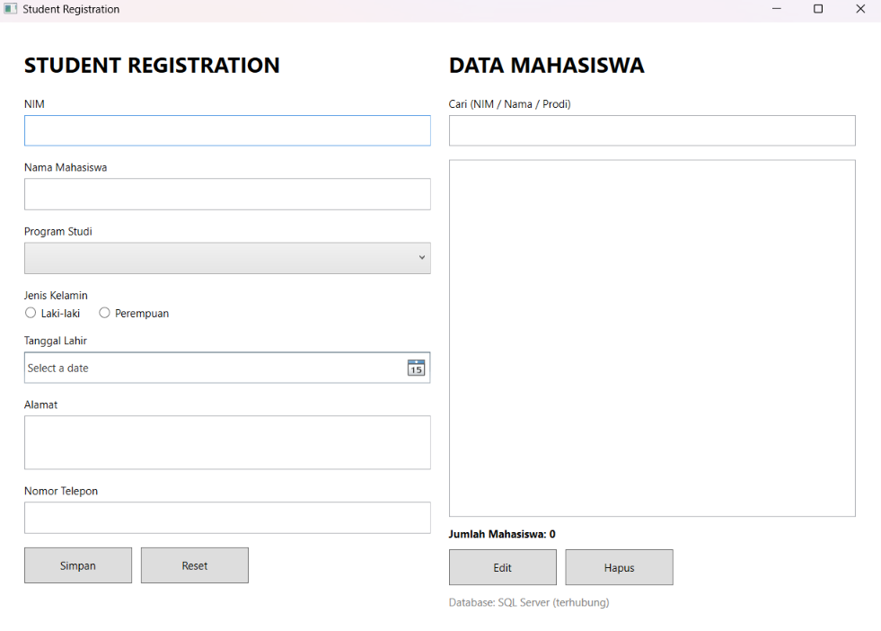

## Step 8 — Tambahkan Validasi

Sebelum proses penyimpanan, `BtnSimpan_Click` memeriksa setiap field dan berhenti (`return`) jika ada yang belum diisi:

```csharp
if (string.IsNullOrWhiteSpace(txtNim.Text))
{
    MessageBox.Show("NIM harus diisi!");
    txtNim.Focus();
    return;
}
// ... Nama, Program Studi, Jenis Kelamin
```

## Step 9 — Membuat Tombol Reset

Tombol **Reset** ditambahkan di samping **Simpan** dalam `StackPanel` horizontal. Event `BtnReset_Click` mengosongkan seluruh input (`Clear()`, `SelectedIndex = -1`, `IsChecked = false`) dan memindahkan fokus ke `txtNim`.

## Step 10 — Tambahkan Tombol Hapus

Tombol **Hapus** menghapus item yang dipilih di ListBox; jika belum ada yang dipilih muncul pesan "Pilih data yang ingin dihapus!". Karena ListBox pada versi akhir terhubung ke database (lewat `ItemsSource`), penghapusan dilakukan ke repository lalu list dimuat ulang, bukan `lstMahasiswa.Items.Remove(...)`.

Operasi aplikasi:

```
          STUDENT APP
               │
     ┌─────────┼─────────┬─────────┐
     ↓         ↓         ↓         ↓
  CREATE     READ     UPDATE    DELETE
     │         │         │         │
  Simpan    ListBox    Edit      Hapus
```

---

## Step 11 — Uji Aplikasi


| No | Skenario | Hasil yang Diharapkan | Hasil Aktual | Status |
|---|---|---|---|---|
| 1 | Semua field kosong | Muncul validasi | | ☐ Berhasil |
| 2 | NIM kosong | Muncul pesan NIM | | ☐ Berhasil |
| 3 | Nama kosong | Muncul pesan Nama | | ☐ Berhasil |
| 4 | Prodi belum dipilih | Muncul pesan Prodi | | ☐ Berhasil |
| 5 | Gender belum dipilih | Muncul pesan Gender | | ☐ Berhasil |
| 6 | Semua data benar | Data masuk ListBox | | ☐ Berhasil |
| 7 | Klik Reset | Form kosong | | ☐ Berhasil |
| 8 | Pilih data + Hapus | Data terhapus | | ☐ Berhasil |

### 1. Semua field kosong

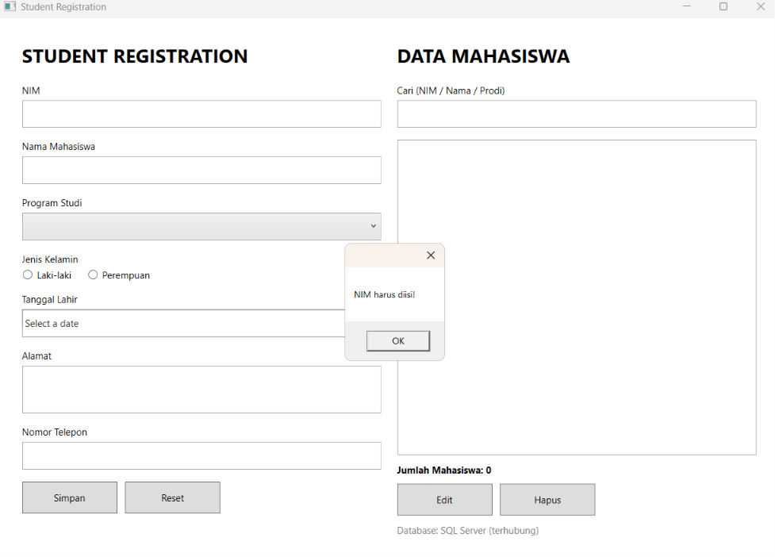

### 2. NIM kosong

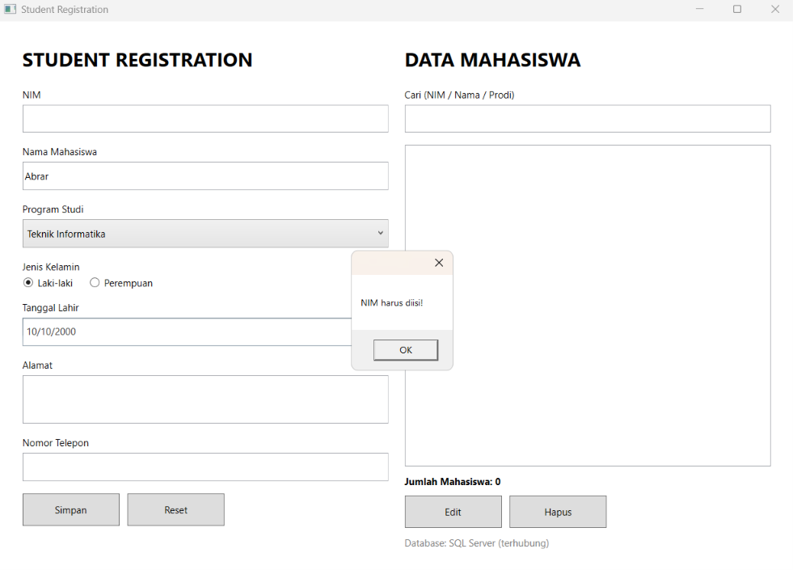

### 3. Nama kosong

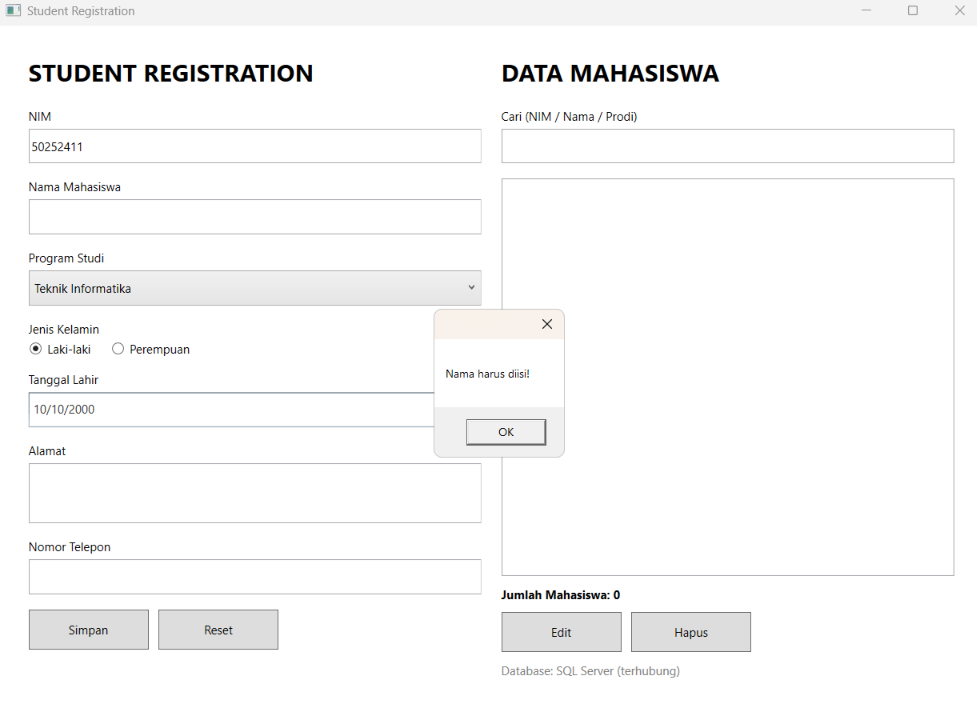

### 4. Prodi belum dipilih

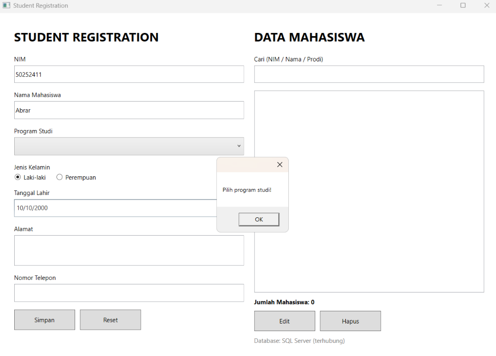

### 5. Gender belum dipilih

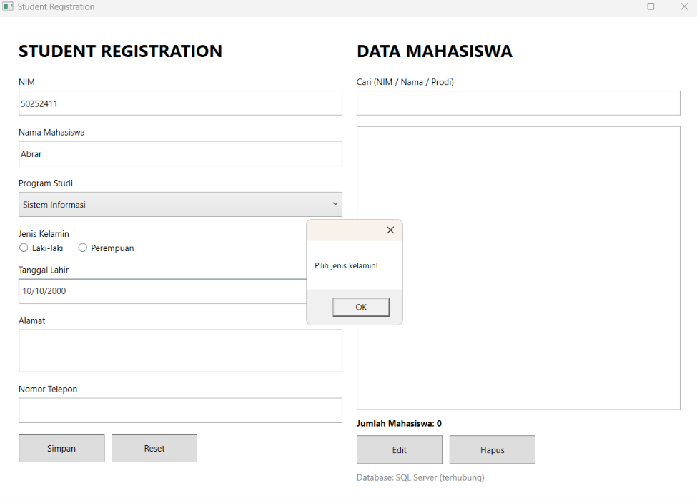

### 6. Semua data benar

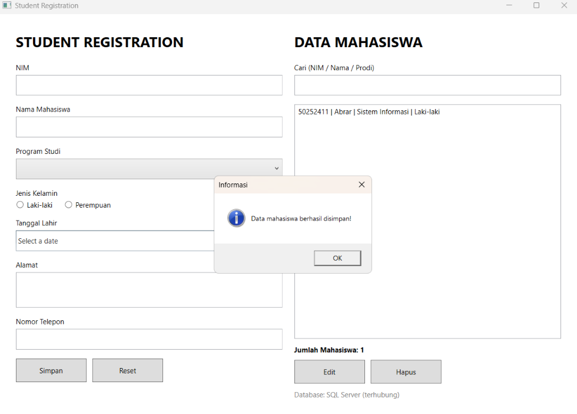

### 7. Klik Reset

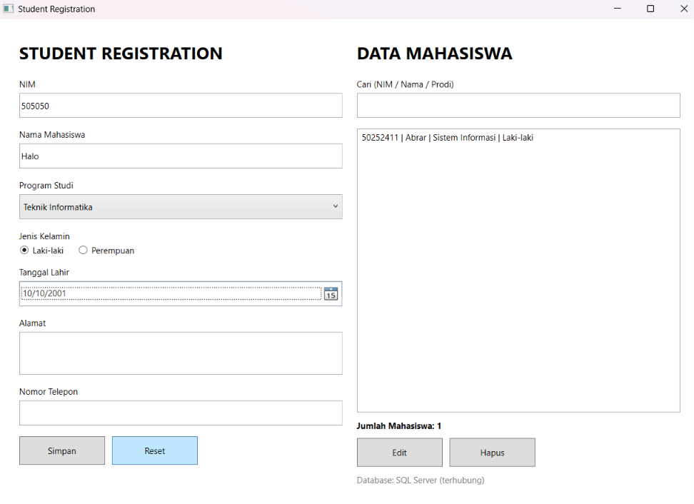

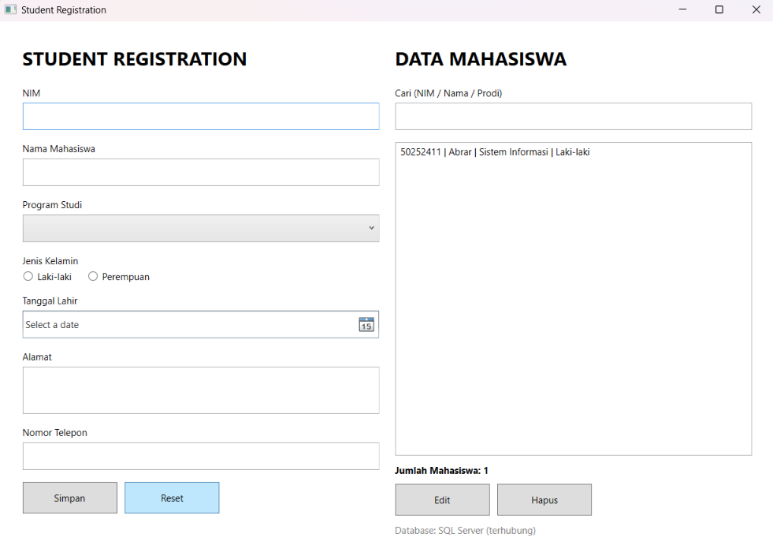

### 8. Pilih data + Hapus

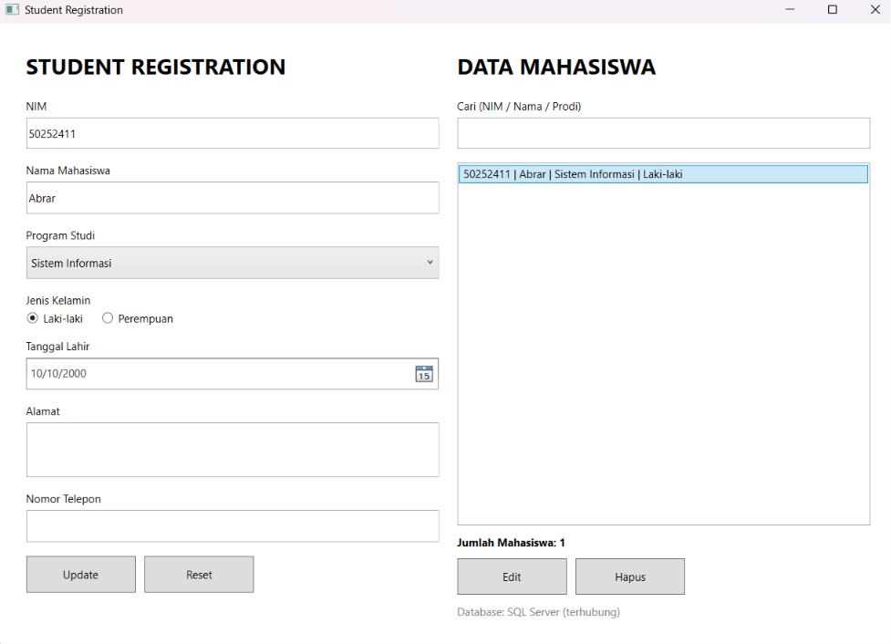

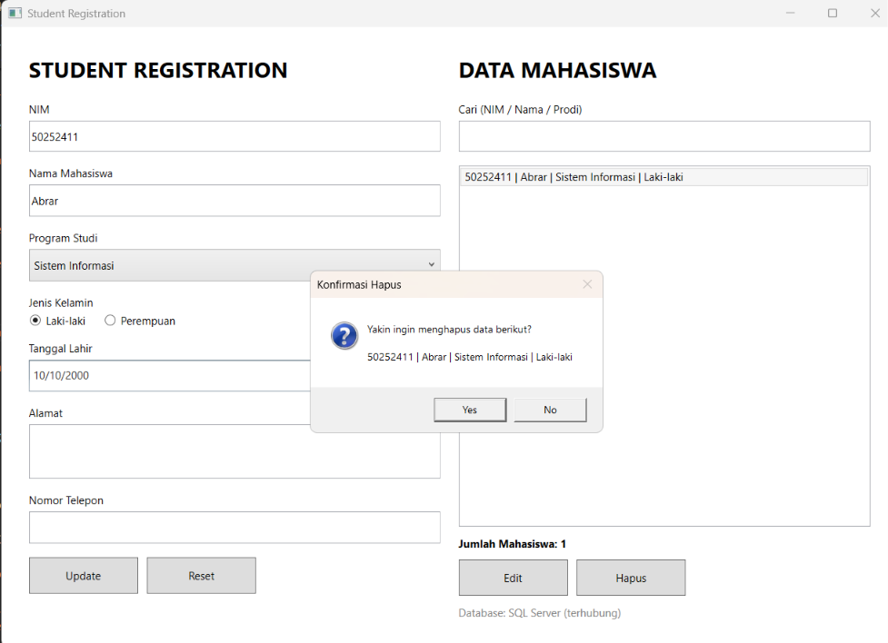

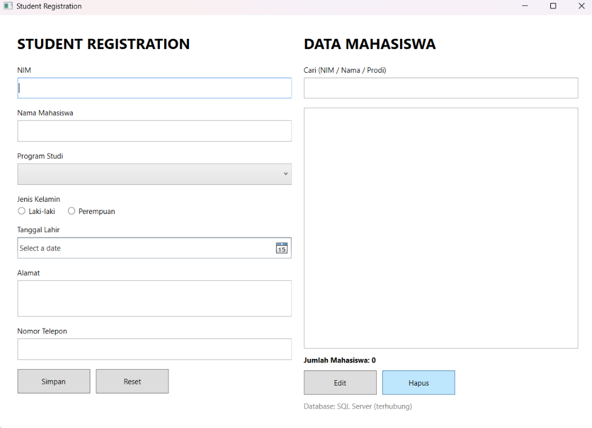

---

## Step 12 — Tantangan Pengembangan

### Level 1 — UI

Ditambahkan tiga input baru pada form:

| Kontrol | Nama | Keterangan |
|---|---|---|
| `DatePicker` | `dpTanggalLahir` | Tanggal lahir; divalidasi tidak boleh melebihi hari ini |
| `TextBox` | `txtAlamat` | Alamat, multi-baris (`AcceptsReturn="True"`) |
| `TextBox` | `txtTelepon` | Nomor telepon; divalidasi hanya berisi angka |

Karena form menjadi lebih panjang, kolom form dibungkus `ScrollViewer`.

### Level 2 — Functionality

| Fitur | Implementasi |
|---|---|
| **Edit data** | Pilih data lalu klik **Edit** (atau klik dua kali pada item). Data dimuat ke form, tombol **Simpan** berubah menjadi **Update**. Klik **Reset** untuk membatalkan edit. |
| **Search mahasiswa** | `TextBox` `txtSearch` dengan event `TextChanged` memfilter list berdasarkan NIM, Nama, atau Prodi (tidak case-sensitive). |
| **Konfirmasi sebelum hapus** | `MessageBox` dengan tombol **Yes/No**; data hanya dihapus bila memilih **Yes**. |
| **Counter jumlah mahasiswa** | `TextBlock` `txtJumlah`, contoh: `Jumlah Mahasiswa: 12`. Saat mencari ditampilkan juga jumlah hasil filter. |
| **Cek NIM duplikat** | (tambahan) NIM yang sudah terdaftar tidak bisa disimpan lagi. |

### Level 3 — Database

Arsitektur aplikasi dikembangkan menjadi:

```
WPF
├── XAML                (MainWindow.xaml)
├── C#                  (MainWindow.xaml.cs, Models/Mahasiswa.cs)
└── Database            (Data/SqlMahasiswaRepository.cs)
    └── SQL Server      (StudentRegistrationDb)
```

Tabel `Mahasiswa` (lihat `Database/schema.sql`):

| Kolom | Tipe | Keterangan |
|---|---|---|
| Id | `INT IDENTITY` | Primary key |
| Nim | `VARCHAR(20)` | `NOT NULL`, `UNIQUE` |
| Nama | `NVARCHAR(100)` | `NOT NULL` |
| Prodi | `NVARCHAR(50)` | `NOT NULL` |
| JenisKelamin | `NVARCHAR(20)` | `NOT NULL` |
| TanggalLahir | `DATE` | nullable |
| Alamat | `NVARCHAR(255)` | nullable |
| NoTelepon | `VARCHAR(20)` | nullable |

Akses database menggunakan package `Microsoft.Data.SqlClient` dengan **parameterized query** (`@nim`, `@nama`, ...) untuk mencegah SQL injection. Operasi CRUD dibungkus dalam interface `IMahasiswaRepository`, sehingga UI tidak bergantung langsung pada SQL Server — bila koneksi gagal, aplikasi otomatis memakai `InMemoryMahasiswaRepository`.

```csharp
public interface IMahasiswaRepository
{
    List<Mahasiswa> GetAll();
    bool NimExists(string nim, int excludeId = 0);
    void Insert(Mahasiswa mhs);
    void Update(Mahasiswa mhs);
    void Delete(int id);
}
```

### Pengujian Tantangan Pengembangan

| No | Skenario | Hasil yang Diharapkan | Status |
|---|---|---|---|
| 9 | Isi tanggal lahir, alamat, telepon lalu Simpan | Data tersimpan lengkap |  Berhasil |
| 10 | Nomor telepon berisi huruf | Muncul pesan "Nomor telepon hanya boleh berisi angka!" |  Berhasil |
| 11 | Tanggal lahir di masa depan | Muncul pesan tanggal lahir tidak valid |  Berhasil |
| 12 | Pilih data + Edit, ubah, klik Update | Data di list berubah |  Berhasil |
| 13 | Ketik kata kunci di kolom Cari | List terfilter sesuai kata kunci |  Berhasil |
| 14 | Klik Hapus lalu pilih **No** | Data tidak terhapus |  Berhasil |
| 15 | Klik Hapus lalu pilih **Yes** | Data terhapus, counter berkurang |  Berhasil |
| 16 | Simpan NIM yang sudah ada | Muncul pesan "NIM sudah terdaftar!" |  Berhasil |
| 17 | Tutup lalu buka kembali aplikasi | Data tetap ada (tersimpan di SQL Server) |  Berhasil |

#### Level 1 — Form dengan DatePicker, Alamat, Telepon

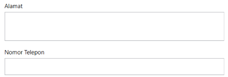

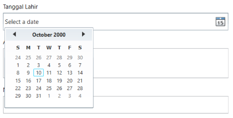

#### Level 2 — Edit Data

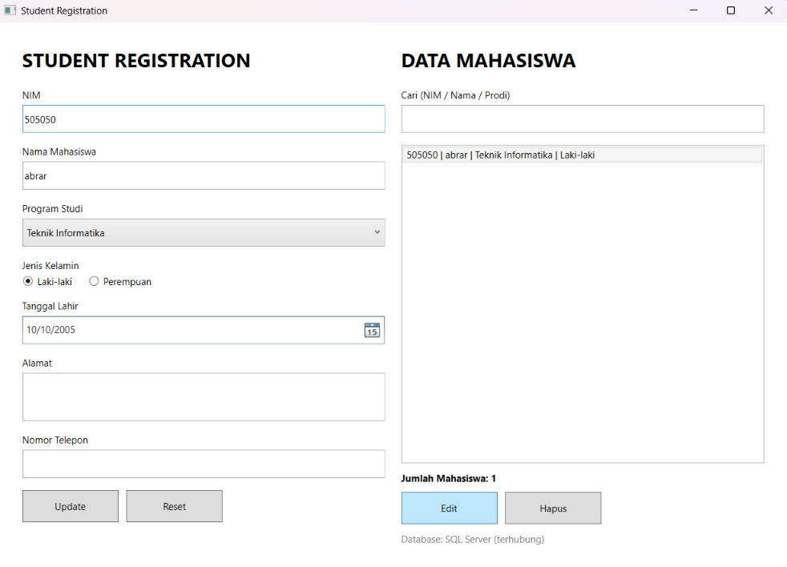

#### Level 2 — Search Mahasiswa

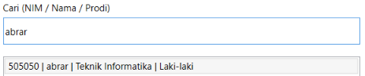

#### Level 2 — Konfirmasi Hapus

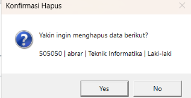

#### Level 2 — Counter Jumlah Mahasiswa

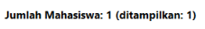

#### Level 2 — NIM Duplikat

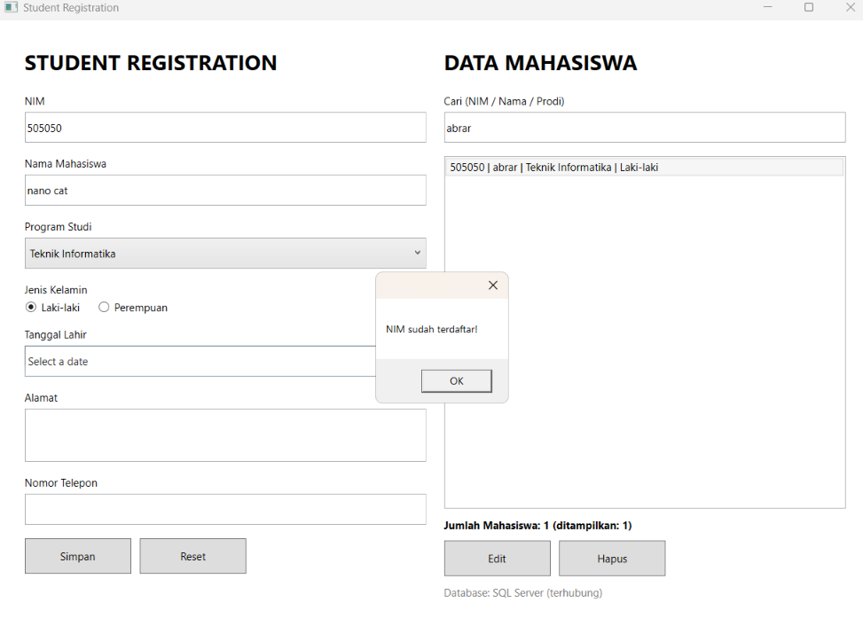

#### Level 3 — Status Koneksi Database

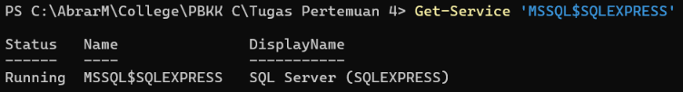

#### Level 3 — Data di SQL Server

Pengecekan dilakukan dengan menjalankan (klik dua kali) `StudentRegistrationApp/Database/cek-database.bat`. Skrip ini terhubung ke `.\SQLEXPRESS`, menampilkan info server dan status koneksi, lalu menjalankan query berikut:

```sql
SELECT * FROM StudentRegistrationDb.dbo.Mahasiswa;
```

Data `5025241 | Abrar` diinput melalui aplikasi, sehingga membuktikan aplikasi benar-benar menyimpan data ke SQL Server. Query yang sama juga bisa dijalankan dari SSMS atau Visual Studio (SQL Server Object Explorer, server `.\SQLEXPRESS`).

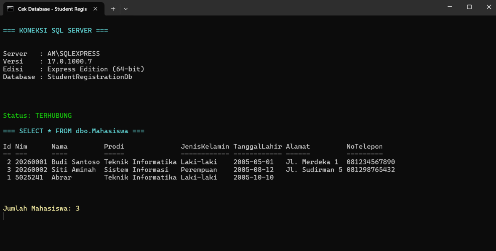

---

